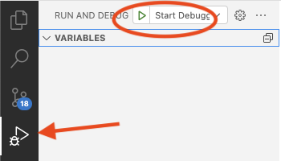

# Branded Calling

Branded Calling allows you to increase trust and transparency with voice conversations. You by adding the Vonage Client SDK to your Android/iOS application, you can call your users and display a reason for the call. This project is a server which allows you to set up branded calling with Vonage SIP Trunking, and create users for the Vonage Client SDK. You can either quick deploy via Vonage's Code Hub or run the project locally.

## Quick deploy

### Vonage Code Hub

While this code can be run locally or on your own server, this code is also available as a project on Vonage's [Code Hub](). From there you can deploy directly to your Vonage account with almost all of the settings pre-configured for you, including a publically accessible web address you can use with front-end projects.

You can either deploy the code as-is by clicking on "Deploy Code", or if you would like to make edits to the source code you can click "Get Code" to be dropped into an editor. You can then customize the sample application and deploy to Vonage Cloud Runtime. You can start the debugger or use the termina.

#### Start the debugger



To open the project in your browser in the bottom panel, open the "Terminal" tab then open the debug link.


### Use the Terminal

If you choose "Get Code" once the workspace opens you will need to install the dependencies for the project. You can do this by running in the "Terminal":

```
npm install
```

Once all of the dependencies are install, you can start debugging the project by running this command in the "Terminal":

```
vcr debug
```

The terminal will give you a debug URL which you can use while you are interating over your code. Once you are ready to deploy, run this command:

```
vcr deploy
```

View the [deploying guide](https://developer.vonage.com/vcr/guides/deploying) to learn more about deploying on Vonage Cloud Runtime which powers Code Hub.

## Run Locally 

You will need to install the dependencies for the project. You can do this by running in the "Terminal":

```
npm install
```

Then you can start the app by running:

```
node index.js
```